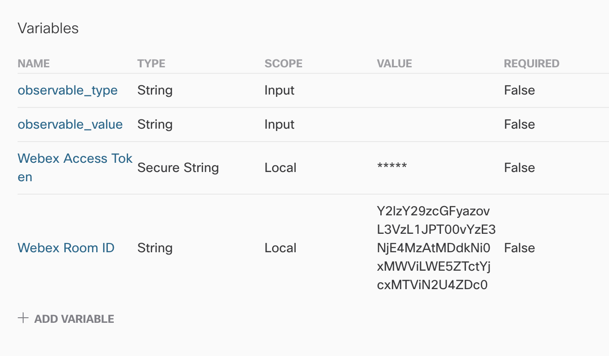
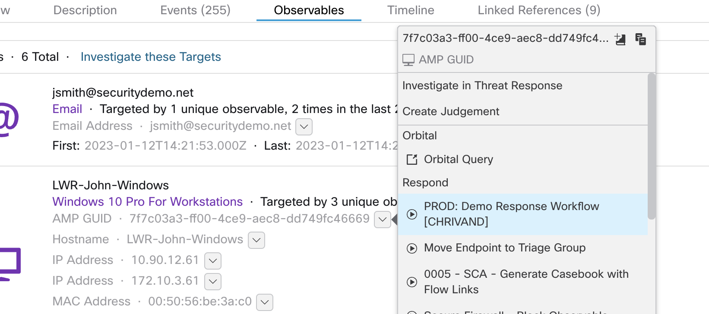

# Isolate an Endpoint with tier-2 Approval

## Overview
=> Goal: Trigger this workflow when you have suspicion of an endpoint being targetted in an ongoing attack. 
=> Input: `amp_computer_guid` (Cisco Secure Endpoint identifier for a device)

### Workflow Steps:
1. Create an approval request to isolate the target endpoint.
2. Send a notification to the SOC Webex Space to investigate the target endpoint further.
3. Waits for approval...
4. If approved, isolate an endpoint if given an observable that can identify an endpoint (e.g Cisco Secure Endpoint GUID) and send notification to SOC Webex Space.

## Installation
1. Browse to your SecureX orchestration instance. This wille be a different URL depending on the region your account is in: 

* US: https://securex-ao.us.security.cisco.com/orch-ui/workflows/
* EU: https://securex-ao.eu.security.cisco.com/orch-ui/workflows/
* APJC: https://securex-ao.apjc.security.cisco.com/orch-ui/workflows/

2. Click on **IMPORT** to import the workflow:

3. Click on **Browse** and copy paste the content of the [isolate_endpoint_with_approval.json](https://raw.githubusercontent.com/chrivand/isolate_endpoint_with_approval/master/isolate_endpoint_with_approval.json) file inside of the text window. 

4. Click on **IMPORT**. You will now receive an error that information is missing: 

5. Click on **UPDATE** and fill in the Webex API key (Input Variable: "Webex Access Token").

> **Note:** Please retrieve your Webex key from: [https://developer.webex.com/docs/api/getting-started](https://developer.webex.com/docs/api/getting-started). Please be aware that the personal token from the getting started page only works for 12 hours. Please follow these steps to request a "bot" token: https://developer.webex.com/docs/integrations.

6. Now it is time to test, click on **RUN** in the top right of your window and fill in 2 example values (e.g. `observable_type`: `amp_computer_guid`, observable_value`: `123456789`), and everything should be working now. The workflow will fail as this is not the correct `amp_computer_guid`, but you can test the workflow. 

7. This workflow is a so called "Response" workflow, and can be triggered from the SecureX Threat Response pivot menu, when clicking on an `amp_computer_guid`:

## Notes

* Please test this properly before implementing in a production environment. This is a sample workflow!

## Author(s)

* Christopher van der Made (Cisco)
